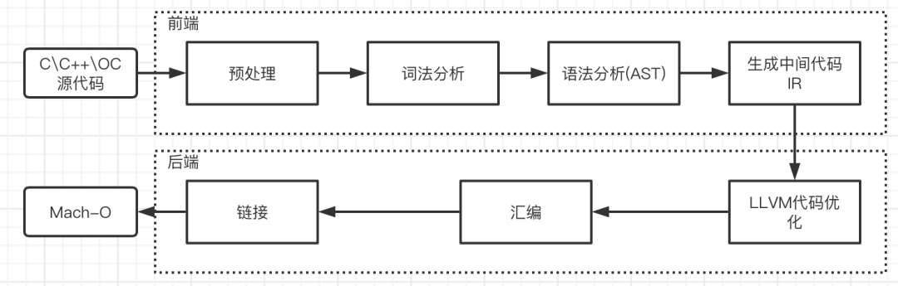
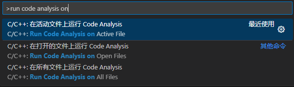
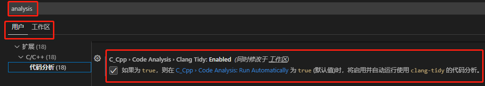
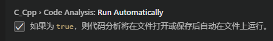
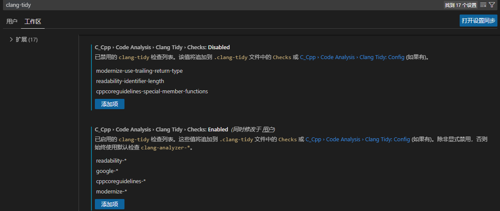
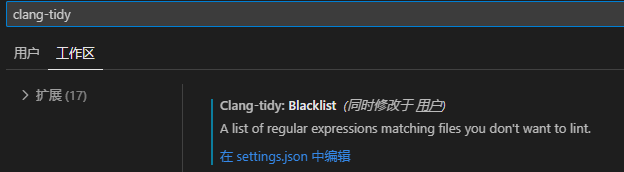
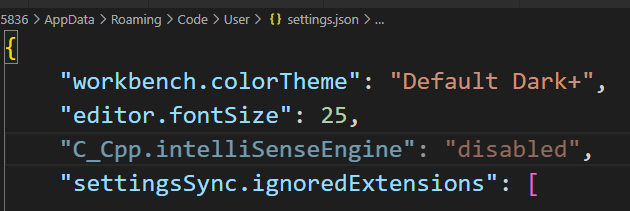

# 主流静态扫描检测工具


# 编译原理

​		编译器一般分为前端和后端，编译器前端主要负责预处理、词法分析、语法分析、语法检查、生成中间代码等与底层计算机架构无关的工作。

后端以中间代码为输入，首先进行架构无关的代码优化，之后针对不同的机器架构生成不同的机器码，进行汇编链接




# clangd/clang-tidy

https://clangd.llvm.org/ clangd官方详细介绍

clang-tidy：

https://clang.llvm.org/extra/clang-tidy/index.html 官方使用使用

https://blog.csdn.net/qq_43577613/article/details/127292732 博客翻译


# clang-tidy install

1. vscode在扩展中搜索clang-tidy并安装(我们这里需要离线手动安装一下https://marketplace.visualstudio.com/vs)

2. github搜索llvm(https://github.com/llvm/llvm-project/)，找到发布包，下载对应的win版本，安装时直接配置下环境变量

3. 手动运行clang-tidy

   

   

   4.指定使用clang-tidy进行代码分析

   或者手动在全局或工作的settings.json文件中添加`"C_Cpp.codeAnalysis.clangTidy.enabled": true`

   

   

   5. 设置为在文件保存时调用

      

   6. 添加检测和禁止检测项

      

   7.  过滤掉某个文件夹不检测

   

   8. 开启微软的代码智能提示功能，命令搜索框输入 settings ，找到open user settings  编辑"C_Cpp.intelliSenseEngine": "disabled",为default




# terminal

```shell
clang-tidy.exe ./main.cpp -checks=cppcoreguidelines-*   
```


# clangd

1. 标准库头文件的警告/自己头文件的警告

   编辑settings.json文件，添加对应的配置信息，告诉clangd去对应的位置找头文件

   ```json
   "clangd.fallbackFlags": [
       "-std=c++17",
       // "-I${workspaceFolder}",
       "-I${workspaceFolder}/math",
       "-Id:/01.soft/mingw64/x86_64-w64-mingw32/include"
   ]
   ```

   

# cmake config

配置cmake使用的编译工具

输入>Edit User-local Cmake Kits 打开cmake-tools-kits.json文件进行相应的编译工具配置

```json
"configurationProvider": "ms-vscode.cmake-tools"
```

CMAKE：`cmake -DCMAKE_EXPORT_COMPILE_COMMANDS=1`，生成compile_commands.json ,使用文档

https://clang.llvm.org/docs/JSONCompilationDatabase.html 官方使用说明

# .clang-tity

```json
Checks:'clang-diagnostic-*,clang-analyzer-*,cppcoreguidelines-*,'
WarningsAsErrors: true
AnalyzeTemporaryDtors: false
CheckOptions:
  - key: cppcoreguidelines-avoid-magic-numbers.IgnoredintegerValues
    value: '100'
```


# 参考资料

1. vscode+clang-tidy https://www.bilibili.com/video/BV1sR4y1X7WF/?spm_id_from=333.999.0.0&vd_source=c2c035b7a76499e23048bf4c9732483e
2. clangd是什么？https://clangd.llvm.org/
3. clang-tidy的检查清单的官方文档：https://clang.llvm.org/extra/clang-tidy/checks/list.html


# A&Q

1. centos 如何安装clang-tidy

2. 禁止标准库头文件的警告
3. clang-tidy实现编译了么？使用说明上指定的编译数据库文件有没有拿来做编译使用
4. 添加的特性选项没有生效，如magic 100 不再提示
5. 检测项如何规定，使用同一份公共的检测项
6. vscode插件中介绍的添加的配置项会自动加到.clang-tidy配置中，目前看貌似没有生效

​		

​	linux安装及使用

```shell
apt-get install clang-tidy
clang-tidy --checks='Checks' test.cpp -- -I ./src/ -x c++
其中–checks=可以写‘*’，表示对所有clang-tidy检查项进行检查，上面‘Checks’是指定检查.clang-tidy文件里的检查项（下面介绍）；test.cpp是要检查的文件；-I是你要包含的头文件路径（可去除）；后面-x c++是指定使用c++编译器（很多时候默认是gcc）（可去除）
```


# 测试demo

```c++
#include <stdio.h>
#include <iostream>
#include <string>
#include <vector>
#include <memory>
#include <array>
#include "add.h"
#include "sub.h"

#define DBG_PRINT (printf("[%s %s %s:%d] ",__DATE__,__TIME__,__FUNCTION__,__LINE__),printf)


//1. 魔数字
void FUN_cppcoreguidelines_avoid_magic_numbers()
{
	int a = 0, b = 10, c = 100;
	int x;
	for (int i = 0; i < 5; ++i) //NOLINT
	{
	}
	for (int i = 0,j = 0; j < c; ++i)   // TODO(): 死循环
	{
		// printf("hello world !!!\n");
		std::cout << "hello world !!!" << std::endl; 
	}

	// NOLINTBEGIN
	for (int i = 0,j = 0; j < 5; ++i) 
	{
	}
	// NOLINTEND
}

//2. 隐士转换+魔数字
int FUN_clang_diagnostic_literal_conversion() {
    int a = 1.2;
    return a;
}

//
int Fun_3()
{
	char* d = NULL;
    return 0;
}
//
int Fun_4()
{
	constexpr auto MAX_SIZE = 10;
	auto index = 1;
	std::vector<int> arr(MAX_SIZE,0);
	for(int i = 0;i < arr.size(); ++i)
	{
		index++;
	}
	index++;
	std::cout << arr[index] << std::endl;
	arr.at(index) = 1;  // TODO(): 数组越界扫不出来？
    return 0;
}

//
int Fun_5()
{
	constexpr auto MAX_SIZE = 100;
	int* ct = new int[MAX_SIZE];
	std::shared_ptr<int> p2(new int(MAX_SIZE));
	auto p3 = std::make_shared<int>(MAX_SIZE);
    return 0;
}

int Fun_6()
{
	int a = 5 / 0;
    return 0;
}

//
int Fun_7(const std::vector<std::string> sv)
{
	auto sv_new = std::move(sv);
	for(auto s : sv_new)
	{
		if(s.find("A"))
		{
			std::cout << s << std:: endl;
		}
	}
	
	std::string sv_1;
	sv_1.find("A");
	auto sv_new1 = std::move(sv_1);
	std::cout << sv_1.data() << std:: endl;

}

int Fun_8()
{
	constexpr auto num = 0.5;
	double expr;
	int round = static_cast<int>(expr + num);
    return 0;
}

void foo(bool TurnKey, bool PressButton);
int Fun_9()
{
	int f = 3;
	if(f = 4) { // This is identified by both `Wparentheses` and this check - should it have been: `if (f == 4)` ?
		f = f + 1;
	}
	foo(true, false);
    return 0;
}

//
struct Base {
	virtual ~Base();
    virtual void func() {
    }
};
struct Derive : Base {
    void func() {
    }
};


int main(int argc,char *argv[])
{
	DBG_PRINT("hello Makefile\n");

	Add *a = nullptr;
	a = new Add();
	Sub *s = new Sub();
	

	DBG_PRINT("10 + 5 = %d\n",a->add(10, 5));
	DBG_PRINT("10 - 5 = %d\n",s->sub(10, 5));
	return 0;
}

```


