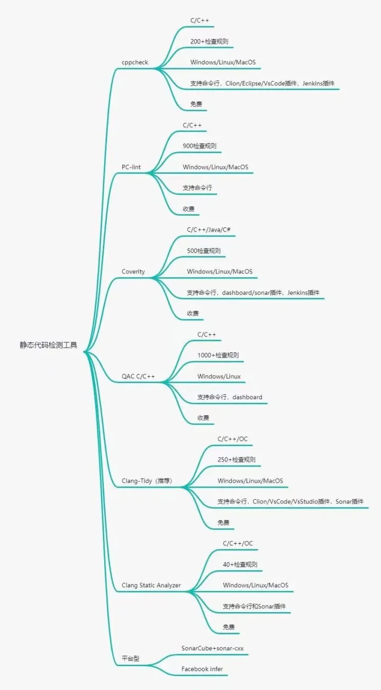
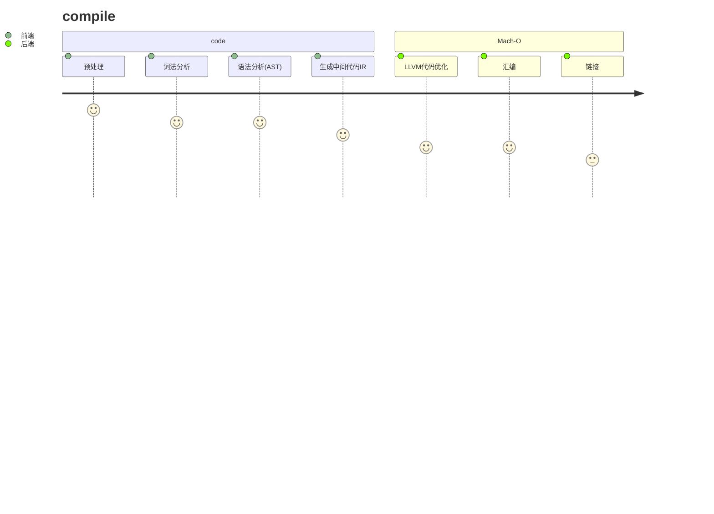

# 1. 主流静态扫描检测工具




# 2. 编译原理

​		编译器一般分为前端和后端，编译器前端主要负责预处理、词法分析、语法分析、语法检查、生成中间代码等与底层计算机架构无关的工作。

后端以中间代码为输入，首先进行架构无关的代码优化，之后针对不同的机器架构生成不同的机器码，进行汇编链接




# 3. clang-tidy install

## 3.1 window:

1. vscode在扩展中搜索clang-tidy并安装(我们这里需要离线手动安装一下 [clang-tidy](https://marketplace.visualstudio.com/items?itemName=notskm.clang-tidy)

2. github搜索[llvm](https://github.com/llvm/llvm-project/)，找到发布包，下载对应的win版本，安装时直接配置下环境变量

3. 插件提供的配置项

   ```shell
   #Extension Settings
   #This extension contributes the following settings:
   clang-tidy.executable: The path to the clang-tidy executable
   clang-tidy.checks: List of checks to enable or disable
   clang-tidy.compilerArgs: List of arguments to append to the compiler command line
   clang-tidy.compilerArgsBefore: List of arguments to prepend to the compiler command line
   clang-tidy.lintOnSave: Whether or not to lint files when they are saved
   clang-tidy.buildPath: Path to the build folder. Equivalent to clang-tidy -p /path
   clang-tidy.fixOnSave: Whether or not to fix files when they are saved
   clang-tidy.blacklist: A list of regular expressions matching files you don't want to lint
   ```

4. settings配置

   ```json
   "C_Cpp.codeAnalysis.clangTidy.enabled": true  //配置文件cpp的分析器使用clang-tidy
   ```

5. 规则配置文件

   > .clang-tidy   #clang-tidy根据此配置文件中的规则项进行检查


## 3.2 linux

1. 源码编译安装


# 4. using clang-tidy

> **clang-tidy** is a clang-based C++ “linter” tool. Its purpose is to provide an extensible framework for diagnosing and fixing typical programming errors, like style violations, interface misuse, or bugs that can be deduced via static analysis. **clang-tidy** is modular and provides a convenient interface for writing new checks.
>
> clang-tidy是一个基于clang的c++“linter”工具。它的目的是提供一个可扩展的框架，用于诊断和修复典型的编程错误，如违反编码风格、接口误用或可以通过静态分析诊断出的错误。Clang-tidy是模块化的，提供了便捷的接口来自定义新的检测项


## 4.1 check list

[常用检测项](https://clang.llvm.org/extra/clang-tidy/)

```cpp
Name prefix			Description
bugprone-			Checks that target bug-prone code constructs.
concurrency-		Checks related to concurrent programming (including threads, fibers, coroutines, etc.).
cppcoreguidelines-	Checks related to C++ Core Guidelines.
modernize-			Checks that advocate usage of modern (currently “modern” means “C++11”) language constructs.
performance-		Checks that target performance-related issues.
readability-		Checks that target readability-related issues that don’t relate to any particular coding style.
...
```

[常用检测项举例]()

- bugprone-infinite-loop

```cpp
int i = 0, j = 0;
while (i < 10) {
  ++j;
}
```

- bugprone-unsafe-functions

```cpp
strcpy(Buf, Prefix); // warning: function 'strcpy' is not bounds-checking; 'strcpy_s' should be used instead.
strcat(Buf, Msg);    // warning: function 'strcat' is not bounds-checking; 'strcat_s' should be used instead.
strcat(Buf, Suffix); // warning: function 'strcat' is not bounds-checking; 'strcat_s' should be used instead.
```

- performance-faster-string-find

```shell
str.find("A");
// becomes
str.find('A');
```

- performance-inefficient-vector-operation

```cpp
std::vector<int> v;
for (int i = 0; i < n; ++i) {
  v.push_back(n);
  // This will trigger the warning since the push_back may cause multiple
  // memory reallocations in v. This can be avoid by inserting a 'reserve(n)'
  // statement before the for statement.
}
```

- performance-unnecessary-value-param

```shell
void f(const string Value) {
  // The warning will suggest making Value a reference.
}
```

```shell
readability-magic-numbers
modernize-make-shared
cppcoreguidelines-no-malloc
cppcoreguidelines-avoid-c-arrays
...
```


## 4.2 屏蔽检查

> lint-command:  
>
> //NOLINT 
>
> //NOLINTNEXTLINE
>
> //NOLINTBEGIN  
>
> //NOLINTEND


## 4.3 .clang-tidy demo

```shell
Checks:'-*,clang-diagnostic-*,clang-analyzer-*,cppcoreguidelines-*,'
WarningsAsErrors: 'false'
HeaderFilterRegex: h
AnalyzeTemporaryDtors: false
CheckOptions:
  - key: cppcoreguidelines-avoid-magic-numbers.IgnoredintegerValues
    value: '100' 
```

- checks：`-*`表示禁止所有的检测项，`clang-diagnostic-*`表示开启和`clang-diagnostic-`有关的所有检测项
- WarningsAsErrors：表示将warning的作为error输出
- HeaderFilterRegex: 
- AnalyzeTemporaryDtors：
- CheckOptions：规则可选项


## 4.4 在linux下使用

>clang-tidy --checks='Checks' test.cpp -- -I ./src/ -x c++
>其中–checks=可以写‘*’，表示对所有clang-tidy检查项进行检查，上面‘Checks’是指定检查.clang-tidy文件里的检查项（下面介绍）；test.cpp是要检查的文件；-I是你要包含的头文件路径（可去除）；后面-x c++是指定使用c++编译器（很多时候默认是gcc）（可去除）

common.sh

incremental_build.sh


# 参考资料

1. [vscode+clang-tidy][ https://www.bilibili.com/video/BV1sR4y1X7WF/?spm_id_from=333.999.0.0&vd_source=c2c035b7a76499e23048bf4c9732483e]

2. LLVM [LLVM 编译器基础结构项目](https://llvm.org/)

3. [clangd](https://clangd.llvm.org/)

4. [clang-tidy的检查清单的官方文档](https://clang.llvm.org/extra/clang-tidy/checks/list.html)

   [clang-tidy的检查清单博客翻译](https://blog.csdn.net/qq_43577613/article/details/127292732)

5. [介绍 `C++ Core Guidelines `的警告](https://learn.microsoft.com/zh-cn/cpp/code-quality/c26400?view=msvc-170)  


# 测试demo

```c++
#include <stdio.h>
#include <iostream>
#include <string>
#include <vector>
#include <memory>
#include <array>
#include "add.h"
#include "sub.h"

#define DBG_PRINT (printf("[%s %s %s:%d] ",__DATE__,__TIME__,__FUNCTION__,__LINE__),printf)


//1. 魔数字
void FUN_cppcoreguidelines_avoid_magic_numbers()
{
	int a = 0, b = 10, c = 100;
	int x;
	for (int i = 0; i < 5; ++i) //NOLINT
	{
	}
	for (int i = 0,j = 0; j < c; ++i)   // TODO(): 死循环
	{
		// printf("hello world !!!\n");
		std::cout << "hello world !!!" << std::endl; 
	}

	// NOLINTBEGIN
	for (int i = 0,j = 0; j < 5; ++i) 
	{
	}
	// NOLINTEND
}

//2. 隐士转换+魔数字
int FUN_clang_diagnostic_literal_conversion() {
    int a = 1.2;
    return a;
}

//
int Fun_3()
{
	char* d = NULL;
    return 0;
}
//
int Fun_4()
{
	constexpr auto MAX_SIZE = 10;
	auto index = 1;
	std::vector<int> arr(MAX_SIZE,0);
	for(int i = 0;i < arr.size(); ++i)
	{
		index++;
	}
	index++;
	std::cout << arr[index] << std::endl;
	arr.at(index) = 1;  // TODO(): 数组越界扫不出来？
    return 0;
}

//
int Fun_5()
{
	constexpr auto MAX_SIZE = 100;
	int* ct = new int[MAX_SIZE];
	std::shared_ptr<int> p2(new int(MAX_SIZE));
	auto p3 = std::make_shared<int>(MAX_SIZE);
    return 0;
}

int Fun_6()
{
	int a = 5 / 0;
    return 0;
}

//
int Fun_7(const std::vector<std::string> sv)
{
	auto sv_new = std::move(sv);
	for(auto s : sv_new)
	{
		if(s.find("A"))
		{
			std::cout << s << std:: endl;
		}
	}
	
	std::string sv_1;
	sv_1.find("A");
	auto sv_new1 = std::move(sv_1);
	std::cout << sv_1.data() << std:: endl;

}

int Fun_8()
{
	constexpr auto num = 0.5;
	double expr;
	int round = static_cast<int>(expr + num);
    return 0;
}

void foo(bool TurnKey, bool PressButton);
int Fun_9()
{
	int f = 3;
	if(f = 4) { // This is identified by both `Wparentheses` and this check - should it have been: `if (f == 4)` ?
		f = f + 1;
	}
	foo(true, false);
    return 0;
}

//
struct Base {
	virtual ~Base();
    virtual void func() {
    }
};
struct Derive : Base {
    void func() {
    }
};


int main(int argc,char *argv[])
{
	DBG_PRINT("hello Makefile\n");

	Add *a = nullptr;
	a = new Add();
	Sub *s = new Sub();
	

	DBG_PRINT("10 + 5 = %d\n",a->add(10, 5));
	DBG_PRINT("10 - 5 = %d\n",s->sub(10, 5));
	return 0;
}

```


